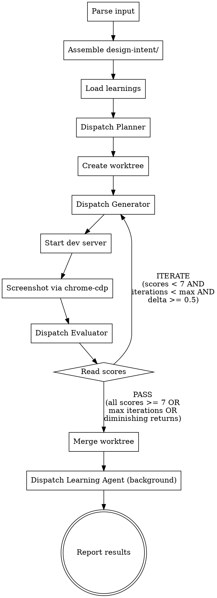

# UX Harness — Self-Improving Design-to-Code Pipeline

Orchestrates a multi-agent feedback loop: PLAN → GENERATE → EVALUATE → ITERATE until quality thresholds are met. Learns from every run to improve future generations.

Inspired by [Anthropic's harness design](https://www.anthropic.com/engineering/harness-design-long-running-apps): separating generation from evaluation (GAN-inspired) produces dramatically better output than self-evaluation.

## When to Use

- User asks to build a frontend component, page, or application from a design description
- User provides reference images, wireframes, or URLs to match
- User wants high-quality UX that matches a specific aesthetic intent
- NOT for quick prototypes or throwaway code — use /frontend-design for that

## Prerequisites

- Chrome with remote debugging enabled (for /chrome-cdp screenshots)
- Node.js 22+ (for cdp.mjs scripts)

## Invocation

The user provides design intent as text, optionally with references:

```
/ux-harness "sales KPI dashboard, dark theme, Bloomberg density"
/ux-harness "match this site" --ref ~/screenshot.png
/ux-harness "editorial landing page" --url https://example.com --max-iterations 3
```

Parse arguments:
- First quoted string = design prompt text
- `--ref <path>` = reference image(s), can be repeated
- `--url <url>` = reference URL(s) to screenshot, can be repeated
- `--max-iterations <N>` = override max iterations (default: 5)

## The Orchestration Loop



## Step-by-Step Coordinator Instructions

### Phase 1: Setup

**Step 1 — Determine run number and create run directory:**

```bash
# Find next run number
RUN_N=$(ls -d .harness/ux/run-* 2>/dev/null | wc -l | tr -d ' ')
RUN_N=$((RUN_N + 1))
RUN_DIR=".harness/ux/run-${RUN_N}"
mkdir -p "${RUN_DIR}/design-intent/references" "${RUN_DIR}/screenshots"
```

**Step 2 — Assemble design intent:**

- Write the user's text prompt to `${RUN_DIR}/design-intent/prompt.md`
- If `--ref` paths provided, copy images to `${RUN_DIR}/design-intent/references/`
- If `--url` URLs provided, use chrome-cdp to screenshot each URL:
  ```bash
  ~/.claude/skills/chrome-cdp/scripts/cdp.mjs list
  # Find or open a tab, navigate to the URL
  ~/.claude/skills/chrome-cdp/scripts/cdp.mjs nav <target> <url>
  ~/.claude/skills/chrome-cdp/scripts/cdp.mjs shot <target> ${RUN_DIR}/design-intent/references/ref-url-1.png
  ```
- If project has DESIGN.md, copy it to `${RUN_DIR}/design-intent/DESIGN.md`
- If project has a Tailwind config, note its path

**Step 3 — Load learnings:**

Read these files if they exist (pass empty string `{}` if they don't):
- `~/.claude/harness/ux/taste.json` → `TASTE_JSON`
- `~/.claude/harness/ux/anti-patterns.json` → `ANTI_PATTERNS_JSON`
- `~/.claude/harness/ux/calibration.json` → `CALIBRATION_JSON`
- `.harness/ux/patterns.json` → `PATTERNS_JSON`

Also read reference files for prompt injection:
- `~/.claude/skills/ux-harness/references/spec-format.md` → `SPEC_FORMAT`
- `~/.claude/skills/ux-harness/references/critique-format.md` → `CRITIQUE_FORMAT`
- `~/.claude/skills/ux-harness/references/scoring-rubric.md` → `SCORING_RUBRIC`
- `~/.claude/skills/ux-harness/references/frontend-design.md` → `FRONTEND_DESIGN_GUIDELINES`

### Phase 2: Planning

**Step 4 — Dispatch Planner subagent:**

Use the Agent tool:
- description: "Plan UX: [first 50 chars of prompt]"
- prompt: Read `~/.claude/skills/ux-harness/prompts/planner.md` and substitute all `{{VARIABLES}}` with actual values from Phase 1

The planner will write `${RUN_DIR}/spec.md`. Verify it exists after the subagent returns.

### Phase 3: Generation-Evaluation Loop

**Step 5 — Create worktree (once, before first iteration):**

```bash
BRANCH_NAME="ux-harness/run-${RUN_N}"
WORKTREE_DIR=".claude/worktrees/ux-harness-run-${RUN_N}"
git worktree add "${WORKTREE_DIR}" -b "${BRANCH_NAME}"
```

**Step 6 — Dispatch Generator subagent:**

Use the Agent tool:
- description: "Generate UX iteration N"
- prompt: Read the appropriate prompt template:
  - Iteration 1: `~/.claude/skills/ux-harness/prompts/generator.md`
  - Iteration 2+: `~/.claude/skills/ux-harness/prompts/generator-iterate.md`
- Substitute all `{{VARIABLES}}`:
  - `{{RUN_DIR}}`, `{{WORKTREE_DIR}}`, `{{ANTI_PATTERNS_JSON}}`, `{{FRONTEND_DESIGN_GUIDELINES}}`
  - For iteration 2+: `{{ITERATION_N}}`, `{{PREV_N}}`, `{{PREV_SCORES}}`

**Step 7 — Start dev server and screenshot:**

After the generator returns:
```bash
# Start a simple server in the worktree (adapt to what was built)
cd "${WORKTREE_DIR}" && python3 -m http.server 8765 &
# OR if it's a Vite project:
cd "${WORKTREE_DIR}" && npm run dev -- --port 8765 &
```

Wait for server to be ready, then screenshot via chrome-cdp:
```bash
CDP=~/.claude/skills/chrome-cdp/scripts/cdp.mjs

# Open the page
$CDP list
$CDP nav <target> http://localhost:8765

# Desktop screenshot
$CDP shot <target> ${RUN_DIR}/screenshots/iter-${N}-desktop.png

# Tablet (resize viewport)
$CDP eval <target> "window.resizeTo(768, 1024)"
$CDP shot <target> ${RUN_DIR}/screenshots/iter-${N}-tablet.png

# Mobile
$CDP eval <target> "window.resizeTo(375, 812)"
$CDP shot <target> ${RUN_DIR}/screenshots/iter-${N}-mobile.png

# Reset to desktop
$CDP eval <target> "window.resizeTo(1440, 900)"

# Interactive screenshots (click key elements, capture states)
# Adapt based on what the spec describes
```

**Step 8 — Dispatch Evaluator subagent:**

Use the Agent tool:
- description: "Evaluate UX iteration N"
- prompt: Read `~/.claude/skills/ux-harness/prompts/evaluator.md` and substitute `{{VARIABLES}}`:
  - `{{RUN_DIR}}`, `{{ITERATION_N}}`
  - `{{SCREENSHOT_PATHS}}` — list all screenshot paths from Step 7
  - `{{CALIBRATION_JSON}}`, `{{SCORING_RUBRIC}}`, `{{CRITIQUE_FORMAT}}`
  - `{{PREVIOUS_CRITIQUES}}` — for iteration 2+, list paths to all prior critique files

**Step 9 — Read scores and decide:**

Read `${RUN_DIR}/critique-${N}.md`. Parse the scores section.

Termination conditions (any → STOP):
1. All four scores >= 7
2. Iteration count >= max_iterations (default 5)
3. Evaluator verdict is PASS on two consecutive iterations
4. Score improvement < 0.5 from previous iteration (diminishing returns):
   `avg(current_scores) - avg(previous_scores) < 0.5`

If STOP: proceed to Phase 4.
If ITERATE: go back to Step 6 with incremented iteration number.

**Between iterations:** Kill the dev server before restarting in Step 7.

### Phase 4: Completion

**Step 10 — Merge worktree:**

```bash
# From the main working directory
git merge "${BRANCH_NAME}" --no-edit
git worktree remove "${WORKTREE_DIR}"
git branch -d "${BRANCH_NAME}"
```

**Step 11 — Initialize learnings stores (if first run):**

```bash
mkdir -p ~/.claude/harness/ux
mkdir -p .harness/ux/history

# Create empty files if they don't exist
[ -f ~/.claude/harness/ux/taste.json ] || echo '{"preferences":[],"last_updated":""}' > ~/.claude/harness/ux/taste.json
[ -f ~/.claude/harness/ux/anti-patterns.json ] || echo '{"patterns":[]}' > ~/.claude/harness/ux/anti-patterns.json
[ -f ~/.claude/harness/ux/calibration.json ] || echo '{"examples":[],"max_examples":5}' > ~/.claude/harness/ux/calibration.json
[ -f .harness/ux/patterns.json ] || echo '{"conventions":[]}' > .harness/ux/patterns.json
```

**Step 12 — Dispatch Learning Agent (background):**

Use the Agent tool with `run_in_background: true`:
- description: "Learn from UX harness run"
- prompt: Read `~/.claude/skills/ux-harness/prompts/learning.md` and substitute all `{{VARIABLES}}`

**Step 13 — Report results to user:**

```
## UX Harness Complete

**Prompt:** [original prompt]
**Iterations:** N
**Final Scores:**
- Design Fidelity: X/10
- Visual Quality: X/10
- Craft: X/10
- Functionality: X/10

**Merged to:** [current branch]
**Run artifacts:** ${RUN_DIR}/

The learning agent is processing this run in the background.
```

## Composition with Existing Skills

- The generator's prompt includes `/frontend-design` aesthetic guidelines (inlined, since subagents can't invoke skills)
- `/design-consultation` can produce a DESIGN.md beforehand that this harness reads as input
- `/design-shotgun` can be used independently for exploration before invoking the harness
- `/chrome-cdp` is used by the coordinator for all screenshot capture

## Troubleshooting

**Chrome not connected:** Ensure remote debugging is enabled in Chrome (chrome://inspect/#remote-debugging). Run `cdp.mjs list` to verify.

**Dev server won't start:** Check what the generator built. If it's plain HTML, use `python3 -m http.server`. If it's Vite/React, use `npm run dev`.

**Scores not improving:** Check if the evaluator's feedback is actionable enough. Read the critique files. If feedback is vague, the scoring rubric may need calibration examples — run a few more iterations to build up calibration.json.

**Worktree conflicts:** If the merge fails, resolve conflicts manually. The worktree branch has all the generated code.
